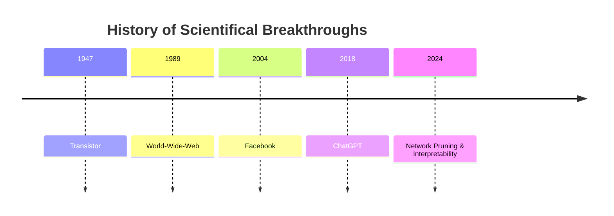

# Network Pruning and Interpretability

## Project Description

Recent work has shown that large, trained networks can be condensed  into significantly smaller scales without sacrificing performance, which is achieved through systematic pruning, the process of removing unnecessary network units. Therefore, our project aims to maintain high classification performance, while pruning the network gradually and retraining the intermediate stages of the network. We now want to investigate models that maintain meaningful performance even at high pruning levels. 

## First Sprint Goals
   1. Runnable and trainable network
   2. Use a sample dataset and ensure results are close to official data
   3. Save and load the network
   4. Implement a functional random pruning mechanism 

## Project Progression

We began by using the PyTorch tutorial, which taught us how to train an image classifier by using the CIFAR10 dataset. Afterwards, we progressed to the PyTorch Pruning Tutorial, where we applied unstructured pruning techniques to the fashionMNIST dataset, which we also saved and loaded.

# Wir im kommenden Semester:

DALL-E created Image of us :)

 
